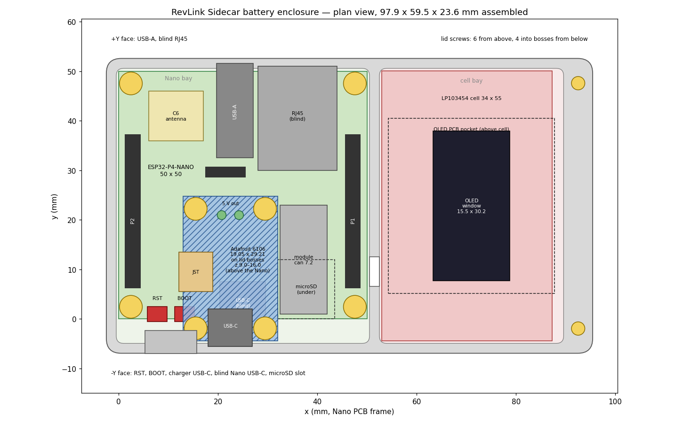

# RevLink Sidecar battery enclosure

> [!WARNING]
> **Not print-ready yet.** The Adafruit 6106's outline, holes and connector
> positions come from Adafruit's published board layout and the board has
> been measured once with its terminal block still fitted. The block is being
> removed, and **the height of the tallest part that remains is the number
> the whole stack hangs on** — it is carried as a measured upper bound until
> the board is measured again. Work through the
> [measurement checklist](#measurement-checklist), update the constants at
> the top of `build_battery_enclosure.py`, rebuild, run `check_fit.py`, and
> only then send geometry to PCBWay. Issue #23 tracks this.

One shell, one lid, two side buttons. Holds the **ESP32-P4-NANO**, the
**1.3-inch SH1106 OLED**, the **Adafruit 6106** charger/boost board and an
**EEMB LP103454** cell (54 × 34 × 10.3 mm).

| | This revision | First cut (PR #24 r1) | Original 55 mm case |
| --- | --- | --- | --- |
| Footprint | **97.95 × 59.0 mm** | 120.0 × 59.0 mm | 55 × 55 mm |
| Assembled height | **23.6 mm** | 23.6 mm | 36.6 mm |
| Cell + charger | yes | yes | no room |
| Charger position | on the lid, above the Nano | own floor bay | — |
| Nano USB-C | concealed (optional service opening) | concealed | exposed |



Authored from scratch: the builder loads no donor file and the directory
carries no upstream attribution. See [Licensing](#licensing).

## Where the charger went, and why not above the cell

The first cut gave the charger its own 20 mm floor bay between the Nano and
the cell. The obvious way to shorten the case is to stack the charger above
the cell, which has 9.3 mm of unused air over it. That was tried first and it
does not close, for two independent reasons:

1. **The OLED already lives above the cell.** Its pocket frame needs 38.4 mm
   of the bay's 55 mm length and the charger needs 30.2 mm; they cannot share
   the bay in plan, and they cannot stack (the OLED module alone uses 5.6 of
   the 9.3 mm). The only other lid area is over the Nano, where the USB-A and
   RJ45 bodies begin at `y` 30–32.5 and stand 15.3–15.8 mm tall: a 38.4 mm
   OLED pocket does not fit in front of them without growing the case in Y
   and burying the microSD slot deeper.
2. **The vertical budget was the terminal block's, not the cell's.** With the
   block gone the tallest part is not the 3.16 mm USB-C: the boost inductor
   sits on a VLC5045 footprint (4.5 mm), and the user's own reading of the
   board — 7.04 mm total over the tallest connector — bounds whatever remains
   at ≤ 5.44 mm above the PCB. Hang that above the cell and the swell gap
   under the mounting screws is 0.6 mm at 23.6 mm assembled: less than the
   ~1 mm a pouch cell puts on in service. Closing it means 25 mm or more.

So the charger goes **above the Nano's −Y half** instead, hanging from four
bosses on the lid between the two 2×13 headers, where the tallest thing
underneath is the Nano's own USB-C receptacle at 5.0 mm and nothing swells.
The cell keeps its own bay with only the OLED above it, and the footprint
still drops by 22 mm. The vertical numbers over the Nano, at the measured
bound: 1.96 mm from the screw heads to the Nano's tallest part, 2.96 mm from
the board's solder tails, 0.6 mm from the inductor to the lid. The builder
recomputes all of these from `CHARGER_MAX_PART_HEIGHT_MM` and refuses to
build if the underside comes within 1.0 mm of the Nano, which happens above
about 6.15 mm — 0.7 mm of headroom over the measured bound.

**Thermal.** The charger's components face the lid, so the inductor and the
bq25185 lose heat upward into the 2 mm plate over a 0.6 mm gap; the bare
underside faces the Nano's low parts across ~3 mm of air. The Nano's own
warm part, the P4 module can, is beside the charger (0.5 mm clear in plan),
not under it. The cell is in the other bay, 20 mm and a rib away from the
charger, with 3.7 mm of air and a foam pad between it and the OLED. Draw is
0.12–0.28 A running and 1 A at most while charging; nothing here needs a
vent, but the cell no longer shares a lid with anything that gets warm.

## Layout

Two floor-level bays side by side along X, in the Nano's own PCB coordinate
frame (PCB `x` 0–50, `y` 0–50, underside `z` 0):

```
 +Y face:  [USB-A] [RJ45 blind]
           +--------------------------+----+---------------------+
           |  C6 ant.    USB-A  RJ45  |    |                     |
           |                          |    |   cell 34 x 54      |
           |P2  ESP32-P4-NANO      P1 |rib |   OLED pocket above |
           |    ..6106 on the lid..   |    |   window 15.5x30.2  |
           |    ..above this half..   |    |                     |
           +--------------------------+----+---------------------+
 -Y face:  [RST][BOOT] [6106 USB-C over blind Nano USB-C] [microSD]
```

- **Nano bay** `x` −0.5..50.5, `y` −4.4..50.6. Four Ø5 posts on the PCB's
  own holes; 15 mm standoffs clamp the board and carry the lid. USB-A and
  the blind RJ45 face +Y; RESET, BOOT, the blind Nano USB-C and the microSD
  slot face −Y through a 2 mm wall. A block on the wall's inner face extends
  the two plunger bores to 4.6 mm so the buttons stay square.
- **Charger** PCB `x` 12.95..32.0, `y` −3.9..25.31, rotated +90° so its
  USB-C faces the −Y wall, its JST edge faces −X (toward `P2`) and its
  header edge stops 0.5 mm short of the module can. It hangs from four
  Ø4.6 lid bosses, screwed from below. In plan it clears `P2` by 7.7 mm,
  `P1` by 13.6 mm, the module can by 0.5 mm and the 1×4 pin row in front of
  the USB-A by 4.06 mm.
- **Cell bay** `x` 52.5..89.6, `y` −4.4..50.6. The cell lies flat on the
  floor, located by the rib and a 2 mm ledge along the right wall. The OLED
  sits in a pocket frame on the lid underside directly above it; the window
  is centred on the bay.

Wiring, all of it short:

- **5 V out → `P2` pins 1 and 3** (the terminal block's pads are at
  (20.7, 21.5) and (24.2, 21.5); `P2` pin 1 is ~20 mm away at the top of the
  header). Two wires, soldered into the pads from the component side with
  the tails trimmed underneath. There is no USB-C-to-USB-C cable inside.
- **OLED → `P1`** (six wires) and `P2` 11 (RES): across the rib, which sits
  2.5 mm below the lid along its whole length.
- **Cell → JST.** The JST is side-entry and faces −X, so the lead crosses
  the rib through the 6 × 6 notch on the JST line (`y` 10.1), runs under the
  charger — 3 mm of air between the Nano's parts and the charger's solder
  tails — comes out at the charger's −X edge and loops back into the JST.
  Budget ~70 mm from the cell's lead exit; a stock 50 mm pigtail may need
  extending. The alternative route is over the top, around the charger's +Y
  end through the 4 mm corridor in front of the USB-A.

## Stack-up

`z` is the Nano frame; the outside bottom is at −5.0.

| `z` (mm) | |
| --- | --- |
| −5.0 … −3.0 | floor, 2.0 |
| −3.0 … 0.0 | Ø5 posts, 3.0 (the Nano's deepest underside part is 2.25) |
| 0.0 … 1.6 | Nano PCB |
| 1.6 … 16.6 | 15 mm M2.5 male/female standoffs — they clamp the Nano *and* carry the lid |
| ≤ 5.0 | Nano parts under the charger (its USB-C receptacle); module can 7.2 beside it |
| 6.96 … 8.96 | charger screw heads (M2.5 pan, 2.0) |
| 7.96 … 8.96 | charger solder tails, trimmed to ≤ 1.0 |
| 8.96 … 10.56 | charger PCB |
| 10.56 … 16.0 | charger parts, ≤ 5.44 (**provisional bound**; USB-C shell top at 13.72) |
| 10.56 … 16.6 | lid bosses, 6.04 tall |
| 15.8 | top of the vertical USB-A receptacle (0.8 clearance) |
| 14.1 | rib top (2.5 below the lid: a wire pass along the whole rib) |
| 7.3 | top of the cell |
| 11.0 … 13.0 | OLED solder joints / wire tails (2 mm allowance) |
| 13.0 … 16.6 | OLED module in the lid pocket, glass against the roof |
| 16.6 … 18.6 | lid, 2.0 |

The height is still set by the Nano's **vertical USB-A receptacle** (14.2 mm
above the PCB) plus floor, posts, PCB, clearance and lid: **23.6 mm**. The
charger stack fits inside that with 0.7 mm to spare at the measured bound.

### What was traded away

- **The charger is on the lid.** Removing the lid brings the charger with it,
  on the ends of the two 5 V wires and the JST lead; leave ~40 mm of slack in
  both. Four screws go in from below before the lid goes on.
- **Screws.** Six M2.5 through the lid (four standoffs, two into the
  right-hand wall) and four M2.5 × 6 up into the lid bosses.
- **Reflashing.** The Nano's USB-C is behind a 2 mm wall and 3.4 mm of air.
  See [Flashing](#flashing-happens-before-assembly).
- **microSD** stays removable but the socket face is 6.4 mm from the outer
  face (2 mm wall, 1 mm scoop, 3.4 mm of bay): an ejected card should reach
  the scoop; tweezers may be needed. Confirm on the real socket (checklist
  item 11).
- **Dupont housings do not fit.** Header pins top out at `z` 10.5 and the lid
  is at 16.6; a 14 mm crimp housing will not. Solder the wires to the header
  pins (top or tails), or use bare crimps.
- **The charger's USB-C is a top-open notch** closed by the lid, like the
  USB-A: with the charger this high the 13 × 7 plug-overmold envelope reaches
  the lid line. The receptacle itself is 3 mm below the lid.
- **The OLED is off-centre** relative to the whole case (it is centred on the
  cell bay, right 40 %).
- **CNC lid stock** grows from 5.6 to 8.1 mm (bosses 6.04 below a 2 mm
  plate); see [Manufacturing](#manufacturing).

## Openings

| Feature | Position | Size |
| --- | --- | --- |
| USB-A | +Y face, `x` 19.2–27.6 | 8.4 wide, top-open notch from `z` −0.5, closed by the lid |
| RJ45 | +Y face, `x` 27.5–44.5 | concealed behind a 1.1 mm face, 0.5 clearance |
| Charger USB-C | −Y face, centre `x` 22.48, `z` 12.14 | 13.0 wide top-open notch from `z` 8.64, the USB-C plug-overmold envelope; nose 1.36 behind the face |
| RESET / BOOT | −Y face, `x` 7.75 / 13.25, `z` 3.25 | Ø2.0 bores through the wall and the 4.6 mm guide block |
| microSD | −Y face, `x` 31–44.5, `z` −3.0–0.3 | slot plus a 1.0 mm deep finger scoop |
| Nano USB-C | −Y face | blind; `NANO_USB_C_SERVICE_OPENING = True` cuts a 13 × 7 service opening below the charger's notch (2.9 mm of wall between them) |
| OLED window | lid, centre (71.05, 23.1) | 15.5 × 30.2 r1.0, the lit area |
| Wire pass | the rib, 2.5 mm under the lid; one 6 × 6 notch at `y` 10.1 | for the cell lead |

## Hardware

| Qty | Part |
| --- | --- |
| 4 | M2.5 male/female brass standoff, 15 mm body, 6 mm male thread, 4 mm AF hex |
| 4 | M2.5 × 5 lid screws into the standoffs |
| 2 | M2.5 × 6 lid screws into the right-hand wall |
| 4 | M2.5 × 6 pan-head screws, charger to lid bosses, from below (head ≤ 2.0 tall) |
| 2 | printed side buttons (`03-…-side-buttons-pair`), PETG |
| 1 | 3 mm closed-cell foam pad, ~34 × 50, between cell and OLED (insulates and preloads the module against the roof; it compresses if the cell swells) |
| — | thin double-sided tape for the OLED glass to the roof; Kapton over the OLED solder side and, optionally, the charger's underside |

Post and boss holes are Ø2.05, 4.6 deep: tap M2.5 in a machined part, or let
the screw form its own thread in MJF nylon. If you prefer heat-set inserts,
set `POST_HOLE_DIAMETER_MM` to the insert's hole (≈3.5) and
`NANO_POST_DIAMETER_MM` / `CHARGER_BOSS_DIAMETER_MM` to ≈6 — but check the
boss against the charger's USB-C shell first (checklist item 6).

## Manufacturing

Designed primarily for **PCBWay MJF (PA12 nylon)** or **SLA**, which is what
"3D printing" means at a service bureau rather than a desktop FDM machine:

- 2.0 mm walls and floor, 1.1 mm RJ45 face, 1.2 mm OLED frame, 1.27 mm boss
  walls around the Ø2.05 holes — all above MJF's 1 mm minimum.
- No snap fits, no print-in-place, no bridges. Both wall openings that reach
  the lid line are top-open notches so no wall spans them.
- Everything is a fastener: standoffs and M2.5 screws.

**CNC (aluminium 6061 or POM)** works with the same files, because the
geometry was drawn to be machinable:

- The shell is two top-open pockets with 1.5 mm internal corner radii
  (Ø3 end mill), four posts, a ledge and the plunger guide block, which is a
  step in the Nano pocket — one setup from the top, no undercuts, no draft.
  Side openings are two further setups (+Y and −Y faces).
- The lid is a 2 mm plate with through features from the top, a 3.6 mm
  OLED pocket frame and four 6.04 mm bosses from below. Machine it from
  8.1 mm stock, or make the lid a plain 2 mm plate and bond a frame ring and
  four turned bosses.
- Tap the ten M2.5 holes. The plungers stay printed (PETG/SLA) regardless —
  their retention flange relies on a little compliance.
- Aluminium makes the cell bay a Faraday enclosure; the C6 antenna is in the
  Nano bay's far corner, but expect to re-check Wi-Fi range.

FDM at home also works: PETG or ASA, 0.2 mm layers, four perimeters; print the
shell open side up and the lid pocket side up (the window needs no support;
the bosses are plain columns).

## Assembly

Two sub-assemblies — the shell carries the Nano and the cell, the lid carries
the charger and the OLED — joined by nine wires and the JST lead.

1. Press both plungers into the −Y bores from outside until the flange snaps
   through.
2. **Flash the Nano first** (below).
3. Prepare the 6106: desolder the green terminal block, solder two ~60 mm
   wires into its pads from the component side and trim the tails flush
   (≤ 1 mm; checklist item 7). Leave the 1×8 header off.
4. Screw the 6106 to the lid bosses with the four M2.5 × 6 from below, USB-C
   toward the lid's −Y edge (the notch side). Tape the OLED into the lid
   pocket, glass to the roof, wires out through a frame notch.
5. Fit the Nano on its posts with the four standoffs. With the lid lying
   open beside the shell, solder the OLED wires to `P1` (and `P2` 11) and
   the 5 V pair to `P2` pins 1 and 3.
6. Lay the cell in its bay, lead end toward the rib, foam pad on top. Pass
   the lead through the rib notch, under the charger and into the JST.
7. Lid on, guiding the charger's USB-C into its notch; six screws.

### Flashing happens before assembly

The Nano's own USB-C is inside the shell. Flash the firmware **before** step
5. To reflash over USB later, either:

- take the lid off (the charger comes with it), unscrew the four standoffs
  and lift the board clear of the −Y wall (leave ~40 mm of slack in its
  wiring), or
- rebuild the shell with `NANO_USB_C_SERVICE_OPENING = True`, which cuts a
  13 × 7 mm opening for the port on the −Y face below the charger's notch.

`docs/FIRMWARE_UPDATE.md` covers the planned browser update path, which will
remove the need for either.

## Measurement checklist

Update the constants named in brackets, rebuild, re-run `check_fit.py`, and
paste the results into the PR. Items marked **done** were measured on the
physical board and are already in the builder.

**Adafruit 6106**

1. **done** — PCB outline. Measured 29.43 × 18.86 (bare PCB) / 19.87 (across
   the JST). The Eagle outline, 29.21 × 19.05 = 1.150 × 0.750 in, is kept as
   the PCB; the 0.22 mm extra length sits inside the 0.5 mm clearance, and
   the 0.82 mm across the JST is the connector's mating face overhanging the
   edge — `CHARGER_JST_OVERHANG_MM`, kept clear of `P2` and the guide block.
   [`CHARGER_PCB_SIZE_MM`, `CHARGER_JST_OVERHANG_MM`]
2. **done** — mounting holes. Centre-to-centre measured **24.13** on the long
   axis (exact) and **13.94** on the short, against the 24.13 / 13.97 the
   Eagle positions give; inset **2.54** from every edge; hole diameter
   **2.52**. The Eagle values are kept rather than refitted to the 0.03 mm,
   which is caliper technique — an imperial grid landing on 0.950 in and
   0.550 in is better evidence than a single reading.

   Note for assembly: 2.52 mm holes give an M2.5 screw almost no play, so the
   board locates on the bosses rather than floating. That is only safe because
   the positions are now confirmed. [`CHARGER_HOLES_MM`]

3. **done** — USB-C is top-mount: 4.76 total at the receptacle = 1.6 PCB +
   3.16 shell. Still to confirm: its centre along the short edge (expect
   9.525) and the shell overhang past the PCB edge (expect ~1.1).
   [`CHARGER_USB_C_CENTER_MM`, `CHARGER_USB_C_OVERHANG_MM`]
4. **done** — tallest part. The 7.04 reading was taken across the JST, so it
   measures the JST rather than the terminal block. The JST is SMT with no
   underside tails, putting it 7.04 − 1.6 = **5.44** above the PCB top, above
   the 4.5 inductor. It is therefore the governing part and remains so once
   the terminal block is removed, which is why that removal does not change
   the constant.

   Distributor listings for an S2B-PH-SM4-TB quote heights that will not fit
   inside 7.04; the board in hand wins, and the fitted part may not be that
   exact variant. The layout refuses above **6.40** — swept against the
   guard — so the design sits with about 1 mm of unused slack.
   [`CHARGER_MAX_PART_HEIGHT_MM`]
5. Confirm the 1×8 header stays **off**. Fitted pointing down, its tails
   would take most of the 2.96 mm between the charger and the Nano.
6. With a Ø4.6 boss on each hole, confirm ≥ 0.3 mm to the USB-C shell and
   the inductor at the two nearest holes (the layout suggests ~0.2 to the
   shell, ~0.45 to the inductor). If either touches, drop
   `CHARGER_BOSS_DIAMETER_MM` to 4.2 — a 1.07 mm boss wall is still above
   the MJF minimum.
7. Underside after rework: the USB-C shell legs and the two wire tails must
   be ≤ 1.0 below the PCB. [`CHARGER_UNDERSIDE_DEPTH_MM`]

**SH1106 OLED module**

8. Thickness from glass face to PCB back, without pins (expect ~3.6).
   [`OLED_MODULE_THICKNESS_MM`]
9. Lit-area centre offset from the PCB centre, X and Y, and which edge has
   the pads. Typical modules are offset ~2.5 mm away from the pad edge.
   [`OLED_ACTIVE_OFFSET_MM`, `OLED_WIRE_EXIT_WIDTH_MM`]
10. Solder/wire height below the PCB back after wiring (must be ≤ 2.0).

**ESP32-P4-NANO**

11. How far the microSD card protrudes past the PCB edge when latched and
    after eject. The socket face is 6.4 mm from the outer face, 5.4 to the
    scoop floor. [`MICROSD_SCOOP_DEPTH_MM`]
12. RESET/BOOT actuator tips at −0.5 mm past the edge, centre `z` 3.25
    (from the board model — a quick sanity check with the plungers fitted).

**Cell**

13. Which short end the lead leaves and its length: ~70 mm reaches the JST
    by the under-charger route described in [Layout](#layout).

## Verification

`tools/stl_inspect.py` on the shipped files:

```
01-revlink-sidecar-battery-shell.stl
  triangles 3090   vertices 1541   shells 1
  bbox  97.95 x 59.00 x 21.60 mm
  watertight True  (boundary edges 0, non-manifold 0)
  euler -4   genus 3   <- through-holes

02-revlink-sidecar-battery-lid-oled.stl
  triangles 3398   vertices 1687   shells 1
  bbox  97.95 x 59.00 x 8.04 mm
  watertight True  (boundary edges 0, non-manifold 0)
  euler -12   genus 7   <- through-holes

03-revlink-sidecar-battery-side-buttons-pair.stl
  triangles 1564   vertices 786   shells 2
  bbox  11.80 x 3.00 x 6.75 mm
  watertight True  (boundary edges 0, non-manifold 0)
  euler 4   genus 0   <- through-holes
```

Shell genus 3 = two plunger bores + microSD slot; the USB-A and charger
USB-C notches are open to the top so they are not holes. Lid genus 7 =
window + six screw holes (the boss holes are blind). Buttons: two solid
bodies.

`check_fit.py` booleans the shell and lid against the Nano board model, a
cell block, the charger envelope (PCB, parts, JST and USB-C overhangs, screw
heads and solder tails), the OLED and the four standoffs, and reports
0.000 mm³ overlap for every pair; fires rays down every port axis; and
measures the promised gaps on the board model itself (Nano tallest part
under the charger 5.00, 1.96 to the screw heads, 2.96 to the tails). It
passes. Run it after any constant changes.

## Rebuilding

Python 3.11+ and the pinned dependencies in `requirements.txt`
(`pip install -r requirements.txt`); `matplotlib` additionally for the
previews.

`trimesh` and `manifold3d` are pinned because they decide the mesh booleans
`check_fit.py` is built on. An engine change could alter its verdict without
any geometry changing, which is the one way this check could quietly stop
meaning what it says.

CI runs `check_fit.py` on every push, so an interference is a failed build
rather than something noticed at the printer.

```sh
python build_battery_enclosure.py      # writes print-package/*.stl and *.3mf
python check_fit.py                    # interference, port-axis and gap checks
python ../tools/stl_inspect.py print-package/*.stl
python preview.py                      # the three preview PNGs
```

The builder prints the derived layout (bay extents, charger position and
heights, boss height, notch/cutout decision, wall thicknesses) so the numbers
in this README can be checked against it. Prefer the 3MF files for a print
service; they record millimetre units.

## Licensing

This directory is CC BY-SA 4.0 like the rest of `hardware/`, with **no
upstream attribution**: it is not a derivative of MartinFaustMayer's case.
The Nano dimensions were measured from the donor's board model (planar
sections of `../enclosure-print/source/esp32-p4-nano-board.stl`); those are
facts about the Waveshare board, not copied geometry, and `check_fit.py` uses
that model only as a test fixture. The 6106 outline, hole and connector
positions and the connector package names were read from Adafruit's
published layout
([adafruit/Adafruit-bq25185-with-5V-Boost-PCB](https://github.com/adafruit/Adafruit-bq25185-with-5V-Boost-PCB),
commit `2ce979f`); no Adafruit file is included. See `../../../NOTICE`.
